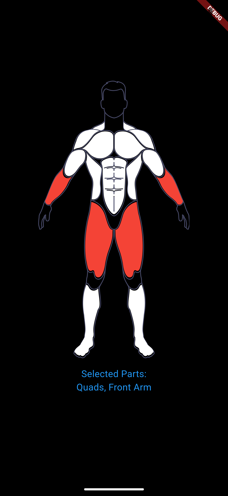
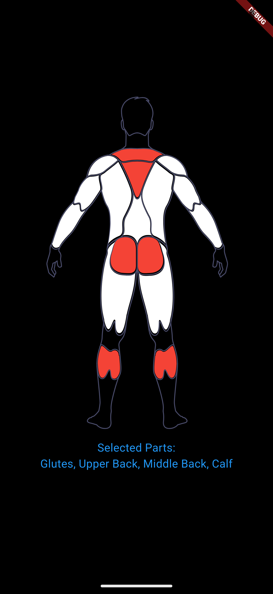

# Select Anatomic Body Parts Flutter Package

## Features

Allows users to select body parts with modern UI.

## Getting started

Run in terminal: flutter pub add select_body_parts , or add select_body_parts:0.0.1 to your pubspec.yaml dependencies section. 

## Usage

 

Package has BodyPartProvider class which developers can access selected body parts. Also front and back body parts are seperated to sake of modularity. 

